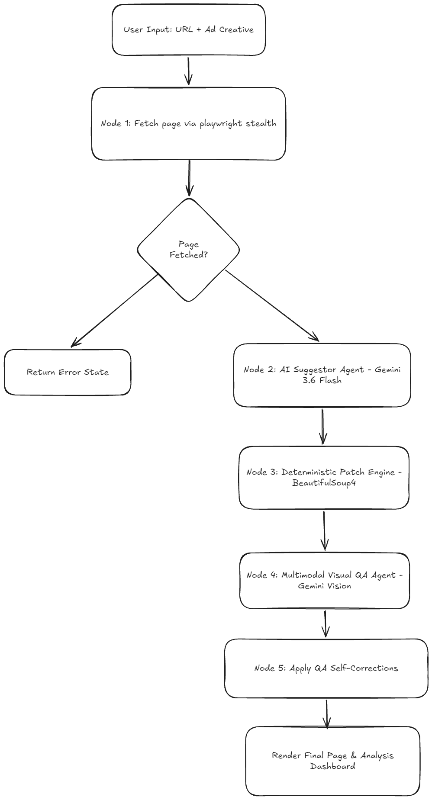

# Converge
> **AI-Powered Landing Page Personalization & Conversion Rate Optimization (CRO) Framework**


[](https://www.python.org/)
[](https://www.djangoproject.com/)
[](https://www.langchain.com/langgraph)
[](https://cloud.google.com/vertex-ai)
[](https://react.dev/)
[](https://tailwindcss.com/)
[](https://playwright.dev/)
[](https://www.docker.com/)

Converge is an enterprise-grade framework designed to dynamically personalize landing pages based on ad creatives (text or image input) and Conversion Rate Optimization (CRO) best practices. Combining **LangGraph**, **Google Gemini 3.6 Flash**, **Playwright Stealth**, and a **deterministic DOM mutation engine**, Converge captures web pages, analyzes conversion opportunities, generates targeted HTML patches with detailed reasoning, performs multimodal Visual QA, and automatically repairs layout anomalies.

---

## Key Features

### 1. Multi-Agent Graph Architecture
* **Orchestrated Workflow:** Utilizes **LangGraph** to execute a 5-node pipeline (`Fetch` -> `Suggest` -> `Apply` -> `Visual QA` -> `Self-Correct`).
* **State Persistence:** Maintains context across execution nodes via `CROState` for auditability and error handling.

### 2. Stealth Capture Engine
* **Anti-Bot Evasion:** Powered by `playwright-stealth` with custom browser context arguments (`--disable-blink-features=AutomationControlled`).
* **DOM Context Isolation:** Extracts target HTML content while preserving original stylesheet links, scripts, and asset dependencies.

### 3. Ad-Aligned Personalization and CRO Injections
* **Ad Copy Harmonization:** Aligns page headlines, subheadings, and call-to-action (CTA) buttons with ad value propositions and tone.
* **Ad Urgency Banners:** Automatically injects prominent offer and urgency notification banners at the top of the body container.
* **Social Proof Signals:** Injects trust badges, star ratings, and user count statistics near primary CTAs.
* **Targeted Testimonials:** Injects conversion-focused testimonial sections tailored to ad claims.

### 4. Hybrid LLM and Algorithmic DOM Modification
* **Zero-Hallucination Structure:** Avoids full-page LLM re-generation by restricting model output to deterministic DOM patch operations (`add`, `update`, `delete`).
* **Deterministic Execution:** Employs a Python `BeautifulSoup4` engine to execute mutations via exact CSS selectors and sibling positioning.

### 5. Multimodal Visual QA and Self-Correction
* **Automated Screenshots:** Renders modified pages in headless Chromium to capture high-resolution full-page screenshots.
* **Vision-Based Inspection:** Submits rendered screenshots and HTML body code to **Gemini 3.6 Flash** vision models to detect layout overlaps, alignment issues, or styling defects.
* **Self-Healing Loop:** Automatically generates and applies corrective visual patches prior to final presentation.

### 6. Interactive UI and Side-by-Side Analysis
* **Multiple View Modes:** Supports `Original`, `Personalized`, and `Side-by-Side` comparison views.
* **CRO Rationale Breakdown:** Interactive dashboard detailing all AI modifications along with target selectors, HTML diffs, and underlying CRO reasoning.
* **Sanitized iFrame Sandbox:** Injects security mocks to isolate analytics trackers while preserving stylesheet fidelity and dynamic responsiveness.

---

## System Architecture & Workflow

Converge operates as an end-to-end multi-stage pipeline designed for high performance, visual fidelity, and strict conversion alignment.



### Stage-by-Stage Execution

1. **Capture (`node_fetch_page`):** 
   Playwright Stealth launches headless Chromium to navigate to the landing page. It extracts full document HTML (`original_html`) and body HTML (`body_html`).
2. **Analyze & Suggest (`node_suggest_changes`):**
   The `body_html` and `ad_creative` are submitted to Gemini 3.6 Flash. The model evaluates the page against CRO principles and returns a JSON array of patch operations.
3. **Apply Algorithm (`node_apply_algorithm`):**
   The backend DOM parser (`BeautifulSoup4`) processes each patch instruction (`add`, `update`, `delete`), updating nodes, inline styles, text content, and attributes cleanly.
4. **Visual QA (`node_visual_qa`):**
   The modified page is rendered in Playwright by hot-swapping inner HTML onto the live origin base. Full-page screenshot bytes are captured and analyzed by Gemini's multimodal vision model to identify visual defects.
5. **Correction Execution (`node_apply_corrections`):**
   Any visual corrections returned by the QA agent are applied back to the DOM tree, producing `final_html`.
6. **Frontend Presentation:**
   React renders side-by-side previews in sandboxed iFrames and presents detailed CRO reasoning in the analysis view.

---

## Technical Deep-Dive: AI Implementation

Converge integrates Generative AI as a structured decision-making engine bound by strict computational and architectural constraints.

### 1. LangGraph State Machine Architecture

The core pipeline is defined using **LangGraph** (`StateGraph`), allowing sequential state transitions and state propagation across nodes.

* **State Model (`CROState`):**
  ```python
  class CROState(TypedDict):
      url: str
      ad_creative: str
      original_html: str
      body_html: str
      final_html: str
      suggested_changes: list      # Pass 1: Initial CRO optimization patches
      screenshot_base64: str       # Pass 2: Base64 image for vision QA
      correction_patches: list     # Pass 2: QA fixes
      errors: Annotated[list, operator.add]
  ```
* **Graph Definition (`pipeline.py`):**
  ```python
  graph = StateGraph(CROState)
  graph.add_node("fetch_page", node_fetch_page)
  graph.add_node("suggest_changes", partial(node_suggest_changes, client=client))
  graph.add_node("apply_algorithm", node_apply_algorithm)
  graph.add_node("visual_qa", partial(node_visual_qa, client=client))
  graph.add_node("apply_corrections", node_apply_corrections)
  ```

---

### 2. Schema-Constrained Structured Generation

To ensure reliable programmatic execution, Converge enforces Google GenAI's native JSON Schema contract (`response_mime_type="application/json"` and `response_schema`).

* **JSON Schema Contract:**
  ```json
  {
    "type": "ARRAY",
    "items": {
      "type": "OBJECT",
      "properties": {
        "action": { "type": "STRING", "enum": ["add", "update", "delete"] },
        "reasoning": { "type": "STRING", "description": "CRO rationale based on ad creative" },
        "target_selector": { "type": "STRING", "description": "CSS selector for target element" },
        "element": {
          "type": "OBJECT",
          "properties": {
            "html": { "type": "STRING" },
            "text": { "type": "STRING" },
            "attributes": { "type": "OBJECT" },
            "styles": { "type": "OBJECT" }
          }
        },
        "position": {
          "type": "OBJECT",
          "properties": {
            "parentElement": { "type": "STRING" },
            "previousElement": { "type": "STRING" },
            "nextElement": { "type": "STRING" }
          }
        }
      },
      "required": ["action", "reasoning"]
    }
  }
  ```

---

### 3. Hybrid AI and Algorithmic DOM Mutation Engine

#### Limitations of Direct Full-Page Generation
Prompting an LLM to rewrite entire HTML documents presents significant operational risks:
* **Structural Hallucinations:** Unintended removal of scripts, CSS tags, analytics snippets, or brand elements.
* **Token Inefficiency:** Unnecessary consumption of input/output tokens on static boilerplate code.
* **Layout Fragility:** Frequent collapse of grid layouts and responsive breakpoints.

#### The Converge Solution
Converge decouples **Strategic Reasoning** (AI) from **DOM Manipulation** (Deterministic Engine):

1. **AI Role:** Operates as a strategic advisor producing minimal patch specifications.
2. **Algorithm Role (`BeautifulSoup4`):** Executes DOM mutations deterministically:
   * **Target Selection:** `soup.select_one(selector)`
   * **Insertion Hierarchy:** Evaluates `nextElement` -> `insert_before()`, `previousElement` -> `insert_after()`, `parentElement` -> `append()`, fallback -> `body.append()`.
   * **Style Merging:** Parses inline CSS into property dictionaries and merges changes without overwriting global stylesheet rules.

---

### 4. Multimodal Vision QA Loop

Converge implements a closed-loop feedback mechanism utilizing multimodal AI vision capabilities (**Gemini 3.6 Flash Vision**):

```python
# 1. Hot-swap modified HTML & capture full-page screenshot
page.evaluate(f"document.documentElement.innerHTML = `{escaped_html}`;")
screenshot_bytes = page.screenshot(full_page=True)

# 2. Pass image bytes & HTML body into Gemini Vision
image_part = types.Part.from_bytes(data=screenshot_bytes, mime_type='image/png')
response = client.models.generate_content(
    model="gemini-3.6-flash-lite",
    contents=[prompt, image_part],
    config={"response_mime_type": "application/json", "response_schema": response_schema}
)
```

The Vision agent evaluates the visual rendering against the underlying HTML structure to detect:
* Text contrast issues
* Unstyled inserted elements
* Overlapping or overflowing containers
* Misaligned CTA buttons

When defects are identified, corrective patch operations are generated and applied prior to final rendering.

---

## Key Challenges & Engineering Solutions

| Challenge | Root Cause | Solution in Converge |
| :--- | :--- | :--- |
| **Hallucination & Code Deletion** | LLMs modifying full page source lose structural elements. | Decoupled architecture: LLM emits JSON patches; `BeautifulSoup4` modifies the DOM deterministically. |
| **Anti-Bot Blocking** | Cloudflare / WAF blocking scraper requests. | `playwright-stealth` with customized browser context flags. |
| **Token Waste & Latency** | Sending entire page source (head, scripts, inline SVGs). | Isolating `document.body.outerHTML` for prompt context while maintaining full page structure for final compilation. |
| **Visual Bugs & Broken CSS** | Injected elements lacking styling or overlapping existing nodes. | Multimodal Vision QA node taking headless screenshots and running self-correction patches. |

---

## Technology Stack

### Backend
* **Framework:** Django REST Framework (Python 3.11)
* **Orchestration:** LangGraph
* **AI Model:** Google Vertex AI / Gemini 3.6 Flash (`gemini-3.6-flash-lite`) via `google-genai`
* **Browser Automation:** Playwright, Playwright Stealth
* **DOM Parsing:** BeautifulSoup4

### Frontend
* **UI Framework:** ReactJS (Vite)
* **Styling:** TailwindCSS
* **Animations:** Framer Motion
* **HTTP Client:** Axios

### Infrastructure & Deployment
* **Containers:** Docker, Docker Compose
* **Web Server:** NGINX
* **Hosting:** Linux VPS

---

## Installation and Setup

### Prerequisites
* Python 3.11+
* Node.js 18+
* Google Cloud Vertex AI credentials / API access

### Local Development Setup

#### 1. Backend Setup
```bash
cd backend
poetry install
# or pip install -r requirements.txt

# Run migrations and start server
python manage.py runserver 8000
```

#### 2. Frontend Setup
```bash
cd frontend
npm install
npm run dev
```

Navigate to `http://localhost:5173` in your browser.
